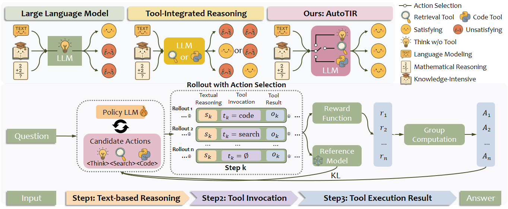

<div align="center">


# AutoTIR: Autonomous Tools Integrated Reasoning via Reinforcement Learning

[](https://arxiv.org/pdf/2507.21836) [](https://huggingface.co/Weiyifan/AutoTIR-Qwen2.5-7B-Instruct) 

</div>

<p align="center">

</p>


Inspired by the human ability to adaptively select tools, we introduce **AutoTIR**, a reinforcement learning framework that enables LLMs to autonomously decide whether and which tool to invoke during the reasoning process, rather than following static tool-use strategies. AutoTIR leverages a hybrid reward mechanism that  jointly optimizes for task-specific answer correctness, structured output adherence, and penalization of incorrect tool usage, thereby encouraging both precise reasoning and efficient tool integration

## 📰 News

- **[2025-08-12]** 🤗 We release our trained [models](https://huggingface.co/Weiyifan/AutoTIR-Qwen2.5-7B-Instruct/tree/main) on Hugging Face, please check it out! 
- **[2025-07-28]** 🎉 We release the paper, update the code and open-source the models.
  - 📝 The **paper is released** on arXiv, more details and evaluation results can be found in our [paper](https://arxiv.org/pdf/2507.21836).
  - 🛠️ The **repository is updated** with the new implementation, especially the rollout with multiple action strategies during RL training. This version of implementation is based on the latest release of verl.


## 📦 Installation

We recommend using conda to manage the environment. First create a conda environment and activate it.

```bash
conda create -n AutoTIR python==3.10.18
conda activate AutoTIR
```

Then install dependencies, and our modified verl and flashrag packages  under ```src/``` will be installed in the editable mode.  Check out ```setup.py``` for details.

```bash
pip3 install torch==2.4.0 --index-url https://download.pytorch.org/whl/cu124
pip3 install flash-attn --no-build-isolation
git clone https://github.com/weiyifan1023/AutoTIR.git
cd AutoTIR
pip3 install -e .
```

As described in the [FlashRAG](https://github.com/RUC-NLPIR/FlashRAG?tab=readme-ov-file#wrench-installation), due to the incompatibility when installing faiss using pip, we need to use the following conda command to install faiss-gpu.

```bash
conda install -c pytorch -c nvidia faiss-gpu=1.8.0
```

## 🚀 Quick Start

### Retriever Serving

As described in our paper, during model training and evaluation, search operation will be conducted in the rollout and inference process. In practice, we host a retriever service via FlashRAG and FastAPI. Hence, the search operation is standardized to be an API call. This serving can be used to decouple the search operation from the reinforcement learning process, making the training and evaluation more clear and flexible.

Before starting the retriever serving, you need download the [pre-indexed wikipedia](https://github.com/RUC-NLPIR/FlashRAG?tab=readme-ov-file#index), [wikipedia corpus and corresponding retriever models](https://github.com/RUC-NLPIR/FlashRAG/blob/main/docs/original_docs/reproduce_experiment.md#preliminary). More details can be found in the documentation of FlashRAG.

For starting the retriever serving, you need to first fill the `scripts/serving/retriever_config.yaml` with the correct path to the retrieval model, index, and corpus, and available GPU ids. Then, you can run the following command to start the retriever serving:

```bash
cd scripts/serving
python retriever_serving.py \
    --config retriever_config.yaml \
    --num_retriever {num_retriever} \  
    --port {port}
```

The started retriever serving will be used in the training and evaluation process in the following part.

### Code Serving

For starting the retriever serving, you can run the following command to start the code (only Python) serving:

```bash
cd scripts/serving
python sandbox.py  --port {port}
```

### Data Preparation

For knowledge-intensive task,
**AutoTIR**,is trained on the training set of MuSiQue, and evaluated on the dev set of HotpotQA, 2WikiMultiHopQA, MuSiQue and Bamboogle. 

For mathematical reasoning task,
**AutoTIR**,is trained on the training set of [DAPO-Math](https://huggingface.co/datasets/BytedTsinghua-SIA/DAPO-Math-17k), [ToRL](https://github.com/GAIR-NLP/ToRL/tree/main/data/torl_data), and evaluated on the dev set of AIME24, AIME25, MATH500 and GSM8K.

For Instruction-following task, **AutoTIR**,is trained on the [RLVR-IF](https://huggingface.co/collections/allenai/tulu-3-datasets-673b8df14442393f7213f372) data, and evaluated on the dev set of LoqiQA and [IFEval](https://huggingface.co/datasets/google/IFEval).

For downloading the datasets, please refer to the `data/download_dataset.sh` script.

```bash
cd data
bash download_dataset.sh
```

For preparing the training and validation data for following reinforcement learning, please run this script to parse the  dataset (e.g MusiQue) to the parquet format.

```bash
cd data
python prepare_musique.py
```


### Training

Our training framework is based on [verl](https://github.com/volcengine/verl), a powerful reinforcement learning framework for LLMs. We deeply customize the verl code to fit our needs, and the modified version of verl is under the `src/verl` directory. The example of training scripts are under `scripts/train`.

#### Single-node training

Here is an example of training Qwen2.5-7B-Instruct with 4 GPUs locally. Note that the training script below **is just an example** for single-node training, using small batch size for quick start, and do not assure the training performance.

```bash
cd scripts/train
bash train.sh \
    --train_batch_size 8 \
    --ppo_mini_batch_size 8 \
    --apply_chat True \
    --prompt_template_name autotir_template_sys \
    --actor_model_path {model/path/to/qwen2.5-7b-instruct} \
    --search_url {your-hosted-retriever-url} \
    --sandbox_url {your-hosted-code-url} \
    --project_name {wandb-project-name} \
    --experiment_name {wandb-experiment-name} \
    --nnodes 1 \
    --n_gpus_per_node 4 \
    --save_freq 5 \
    --test_freq 5 \
    --total_epochs 2 \
    --wandb_api_key {your-wandb-api-key} \
    --save_path {path/to/save} \
    --train_files {path/to/train/parquet/data} \
    --test_files {path/to/test/parquet/data}
```

- For training instruction-tuned models, please use `--apply_chat True` and `--prompt_template_name autotir_template_sys`

### Evaluation

We recommend using [SGLang](https://docs.sglang.ai/) to serve the trained model. You can download our open-sourced models or trained your own models to conduct the evaluation. Here is an example of launching the model serving:

```bash
CUDA_VISIBLE_DEVICES=2,3 python3 -m sglang.launch_server \
        --served-model-name {trained/model/name} \
        --model-path {trained/model/path} \
        --tp 2 \
        --context-length 8192 \
        --enable-metrics \
        --dtype bfloat16 \
        --host 0.0.0.0 \
        --port 80 \
        --trust-remote-code \
        --disable-overlap \
        --disable-radix-cache
```

We use [FlashRAG](https://github.com/RUC-NLPIR/FlashRAG) as the standard evaluation environment. Here is an example of evaluating the performance of AutoTIR-Qwen2.5-7B-Instruct on Bamboogle test set.

```bash
cd scripts/evaluation
python run_eval.py \
    --config_path eval_config.yaml \
    --method_name autotir \
    --data_dir {root/path/to/evaluation/data} \
    --dataset_name bamboogle \
    --split test \
    --save_dir {your-save-dir} \
    --save_note autotir_qwen7b_ins
    --sgl_remote_url {your-launched-sgl-url} \
    --remote_retriever_url {your-hosted-retriever-url} \
    --sandbox_url {your-hosted-code-url} \
    --generator_model {your-local-model-path} \
    --apply_chat True
```

## 🤝 Acknowledge

This training implementation is based on [verl](https://github.com/volcengine/verl) and the evaluation is based on [FlashRAG](https://github.com/RUC-NLPIR/FlashRAG). The serving of retriever is based on [FastAPI](https://github.com/fastapi/fastapi). The model serving is based on [SGLang](https://docs.sglang.ai/). **AutoTIR**,models are trained based on [Qwen2.5](https://qwenlm.github.io/blog/qwen2.5/) and are modifications of the code from [ReSearch](https://github.com/Agent-RL/ReCall/tree/re-search) and [Search-R1](https://github.com/PeterGriffinJin/Search-R1). We sincerely appreciate their contributions to the open-source community.

## 📚 Citation

If you find this work useful, please cite it as follows:

```bibtex
@article{wei2025autotir,
  title={AutoTIR: Autonomous Tools Integrated Reasoning via Reinforcement Learning},
  author={Wei, Yifan and Yu, Xiaoyan and Weng, Yixuan and Pan, Tengfei and Li, Angsheng and Du, Li},
  journal={arXiv preprint arXiv:2507.21836},
  year={2025}
}
```
